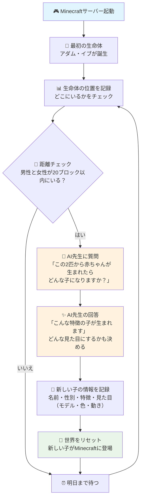

毎日午前3時に1回だけ自動実行されます。

1. 🏁 開始 - アダムとイブが Minecraft世界に現れる
2. 📊 位置記録 - 生命体たちの現在位置を記録
3. 📏 距離判定 - 男性と女性が20ブロック以内にいるかを測定
4. 🤖 AI相談 - 人工知能に「子供はどんな特徴・見た目（種類・色・動き）になる？」と質問
5. 📝 記録更新 - 名前・性別・特徴・見た目（モデル・色・動き）を記録
6. 🔄 世界更新 - Minecraftを再起動して新しい子をスポーン

子供の見た目（モデル・色・動き）はAIが決め、用意されたリストから自動で割り当てられます。

---

