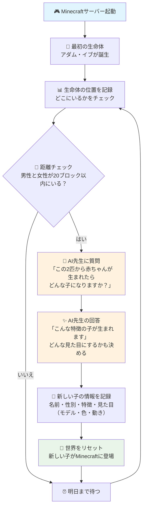

毎日午前3時に1回だけ自動実行されます。

1. 🏁 開始 - アダムとイブが Minecraft世界に現れる
2. 📊 位置記録 - 生命体たちの現在位置を記録
3. 📏 距離判定 - 男性と女性が20ブロック以内にいるかを測定
4. 🤖 AI相談 - 人工知能に「子供はどんな特徴・見た目（種類・色・動き）になる？」と質問
5. 📝 記録更新 - 名前・性別・特徴・見た目（モデル・色・動き）を記録
6. 🔄 世界更新 - Minecraftを再起動して新しい子をスポーン

子供の見た目（モデル・色・動き）はAIが決め、用意されたリストから自動で割り当てられます。

---

### 費用について（2025/06/24 現在の目安）

このシステムを運用するためにかかる主な費用は以下の通りです。

*   **ConoHa VPS for Game (Minecraft Forge 4GBプラン)**: 月額 2,640円
    *   （Minecraftサーバーを動かすための仮想サーバーの費用です）
*   **OpenAI API (ChatGPTモデル: gpt-4o)**:
    *   入力（AIへの質問）: $2.50 / 100万トークン（約70万〜90万文字相当）
    *   出力（AIからの回答）: $10.00 / 100万トークン（約70万〜90万文字相当）
    *   （AIに質問したり、回答を受け取ったりする量に応じて費用が発生します。大量に利用しない限り、大きな費用にはなりません）
*   **Minecraft Java & Bedrock Edition for PC**: 約 4,000円（買い切り）
    *   （Minecraftをプレイするためのゲーム本体の購入費用です）

---

### AIによるMOD開発の現実と進め方

AI（ChatGPT）はシンプルなプログラムは作れますが、MinecraftのMODのようにたくさんの生命体が複雑に動き、バグなく安定して動くもの（何百ものプログラムのまとまり）をゼロから全てAIに作らせるのは、今の技術ではとても難しいです。

人間が作る場合でも、高度な設計と何度もテストが必要です。

そのため、このシステムでは次のように進めます。

*   **すでにあるMODを使う**: まず、すでに安定して動いているMinecraftのMODを土台にします。
*   **AIの役割**: AIは、その土台となるMODの範囲内で、生命体の「動き方」や「見た目」を変える指示を出します。

つまり、AIは新しいMODを完全に作り出すのではなく、既存のMODを使って生命体を「カスタマイズ」する役割を果たします。

---

